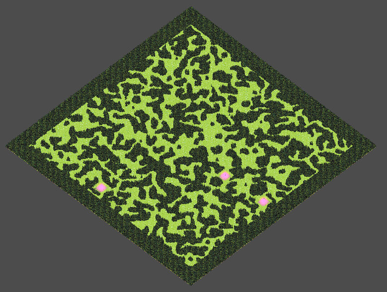
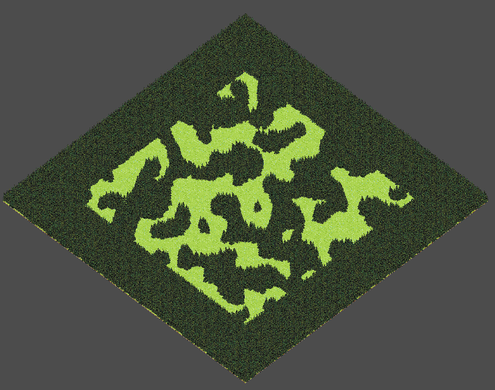
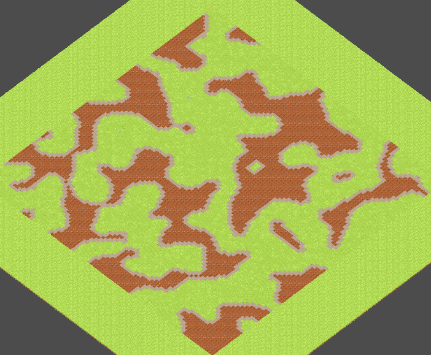
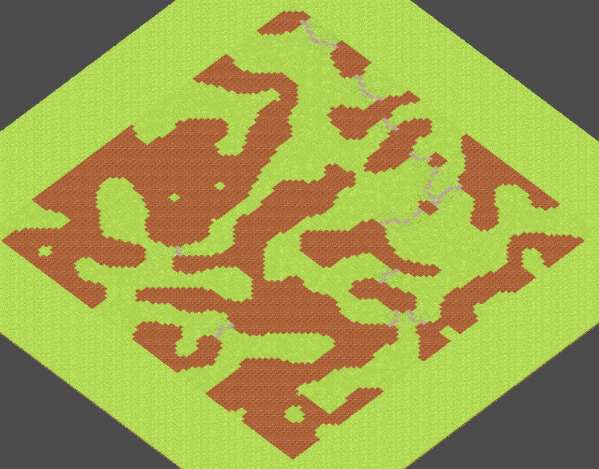
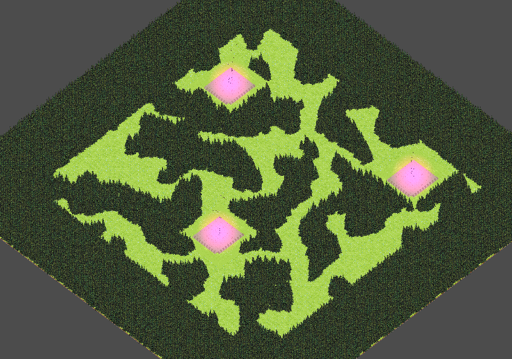

# Game Jam 25 - Top-down Action Game

---

### 👥 Team Members

**Software Developers:**

- Quinn Davis
- Adam Frenzen

**Artist:**

- Jace

---

## What is this?

### 💡 Core Idea

For the Western Colorado University's CS Club's 2nd Game Jam, me and my team decided to work on creating an action game
inspired by the genre established by Vampire Survivors, Brotato, and similar games. The core idea behind the game is
to have a main character which explores a map and fights hordes of enemies with passive weapons. The combat system is
almost entirely passive, meaning the weapons are activated on a timed cycle. The goal of the game is to power up your
passive weapons and make your character overpowered.

---

### 🎮 Game Loop

The player will spawn into the world at a random point in a procedurally generated forest labyrinth. The player will
explore the map and kill enemies, earning new weapons or powering up existing weapons, until they have destroyed three
separate
shrines. At which point a portal will open and the player will step through, which will regenerate the world with
greater difficulty and respawn the player to repeat the process.

---

## 🚀 Cool Systems!

### Procedural Generation

---

#### 🔍 Inspiration

I have always been interested in procedural generation in video games. How do games like Minecraft or Terraria create
such unique and expansive worlds?

I chose to make one of the highlights of this game a procedural world because of this interest. To do this I decided I
would start by researching different ways in which procedural generation is accomplished. After going down a rabbit hole
with
cellular automata and discovering how emergent systems can be created from a simple ruleset, I knew I needed to
implement this into my
game!

**Example of some cool CA generation (Sierpiński triangle):**

> The triangle above is a fractal which can be generated by using a CA algorithm. This is a fantastic example of how
> applying a simple computational rule can create an emergent system as complicated as this! Look into CA rule 90 for
> more info!

---

#### 🎯 The Goal!

To make a system capable of producing a unique and organic looking forest which has 3 handcrafted areas inserted at
random positions that are all accessible by the player.

**Requirements:**

- ⚡ Quick load times, Sub Frame Generation to allow for creating worlds at runtime
- 🔗 No areas that are walkable are disconnected from other walkable areas (THIS WAS TRICKY)
- 🌲 Natural and organic looking forest (Doesn't look fake or generated)
    - Clustered areas to achieve the organic look with windy paths connecting them

---

#### ⚙️ Implementation

I use Cellular Automata as the core engine behind my Procedural Generation System, however there are many steps involved
in the world creation.

I have architected the world generation as a Pipeline.

There is only one pipeline but its stages can be described as Logical or Physical.

Logical stages involve manipulating a 2D array which encodes the world as a collection of cells with an integer
representing their state.

Physical stages involve actually rendering the world onto the window.

To keep things simple I chose to represent only two states in my world: walkable area and non-walkable area.

Eventually these states are mapped to tiles which turn out to be flowers and trees respectively.

**Pipeline flow:**

1. **Generate Terrain**
2. **Find Islands**
3. **Find Connections**
4. **Connect Islands**
5. **Mark Shrines**
6. **Find Player Spawn**
7. **Render Tiles**
8. **Spawn Shrines**

---

##### 🌍 Generate Terrain

This stage focuses on two things: generating a 2D "noise" array that is filled initially with each cell containing a
pseudo-random state based on probability. To accomplish this I use weighted probabilities assigned to each state and run
through them to
decide what state any given cell in the array should be. Once a random noise array is generated I then smooth it using a
CA algorithm. I
played around with a couple different rules but the one that ended up with the best results was a majority rule. For any
given cell,
sample all 8 of its neighbors and identify the most common state of the neighbor cells, that given cell now becomes that
state. This resulted in a
nice looking initial map with proper clustering of areas.

Below is an example of what this stage produces visualized with a tile map:

---

##### 🏝️ Find Islands Stage

In order to ensure that there are no disconnected walkable regions in my world I need to first identify what cells are
disconnected (connected components). That is the focus of this stage. This involved
keeping track of visited cells utilizing a 2D array of booleans mapping to their corresponding cell in the states array,
and iterating through every single cell in the states array and running a recursive Depth First Search on that cell
given it is a
walkable cell. The DFS algorithm will go all the way down a path until finding a non-walkable state, then explore all
the way down
the next path and so on until all walkable cells in a region are visited. While traversing, the algorithm will store
each newly
visited cell in a List. Additionally, I keep track of border cells by checking each visited cell for uniform neighbors,
and if it does not have uniform neighbors adding it to another List - Border Cells. 

Finally, when I finish identifying all the cells in a disconnected walkable region (connected component) I store their information
as an object for future use.

Below is an example of what this stage produces visualized with a tile map (stone tiles are borders and dirt tiles are
islands):

---

##### 🔗 Find Connections Stage

This stage focuses on finding optimal connections between islands to ensure all walkable regions are connected and the
player can access any one of them. This was a really hard problem for me. I went through several different approaches
before I finally learned a working approach to this problem -- a Minimum Spanning Tree. The goal here is to find the
MOST optimal connections between each island, ensuring that all islands are connected, that we connect them using the
least amount of connecting tiles, and we avoid creating cycles. To achieve this there are multiple steps.

First we must generate a List of all possible connections between all islands that contains the distance of that
connection. Matching every island with every other island already has a heavy computational cost (O(n²)). If I want to
find the distance between any two given islands, the first and obvious approach is to, for each pair, go through every
cell in one of those islands with every cell on the other island and find the minimum distance. This however would
result in a total time complexity of O(n⁴) which is just too expensive for runtime generation and our goal of keeping
sub-frame generations.

To solve this problem, when I create an island in the Find Islands Stage I calculate a Centroid or average position for
all the cells on that island (O(n)). Then for each island pair I only need to compare their Centroids, which is constant
time. This helped reduce load times a lot! Additionally, I avoid an expensive square root operation by using the Length
Squared Vector Math since I only need a magnitude to judge.

Okay, so now I've got a List of all possible Island Connections with each connection having a distance! For future
reference, an island connection will be referred to as an Island Edge.

Now I need to find optimal connections and avoid cycles (needless extra connections). To do this I first sort the island
edge List by their distance in ascending order. Then I run through each edge and decide whether or not to connect them.
If they should be connected, I add the edge to a List - Valid Island Edges.

You may be wondering, how do I determine whether or not to connect them? I used Union Find to add connected islands to
the same union, and then if I find an edge with both islands already in the same union I do not connect them! This
appropriately avoids cycles in my connections and keeps with the goal of having optimal connections, effectively
generating a MST!

---

##### 🛤️ Connect Islands Stage

This stage focuses on actually connecting the islands by using the Valid Connections identified in the prior stage, and
then
setting the cells between the two connection points to have the same state of the island (Walkable State). To accomplish
this
I go through each valid connection, then compare all the border cells in one island of the connection with the border
cells in
the other island of the connection to find the closest two border cells (O(n²)). Once I identify the two connection
points,
I also wanted to
make sure these connections looked organic instead of just straight lines between each island. For this I used curve
interpolation.
I create a Curve to define how a path should look and based upon progress from point A to B I interpolate how far along
a perpendicular
direction and a straight direction I should be setting my cells. This results in some nice curvy, natural looking paths
being generated.

Below is an example of what this stage produces visualized with a tile map (stone tiles are paths and dirt tiles are
islands):

> NOTE
>
> While these paths are shown as having a radius of 1 cell, I actually set multiple neighbors for each path cell which
> results
> in wider paths

---

##### 🏛️ Mark Shrines Stage

This stage focuses on finding ideal placements for each of the handcrafted scenes or "shrines" that will be spawned in
the map. To accomplish this I use the islands that I found in the Find Islands Stage. Each island is a cluster of
walkable terrain, so what better place to spawn one of these shrines than that? It guarantees that the player will be
able to access the shrine!

To find these ideal island spawns I first define how many of these shrines I should spawn, we will call this n. So far
the number I have been using is 3, but I plan to increase the number of shrines each game loop to help balance the
difficulty.

The algorithm to find the spawn points is rather simple. I pick a random island from all the stored islands, then I use
its centroid as a root position for the shrine. I determine if the root position is greater than a minimum distance from
other shrines I have already marked and created. If so, then I identify which direction contains x in-bounds cells in
width and y in-bounds cells in height based on my states array, where x is shrine width in tiles, and y is shrine height
in tiles. Once I determine a direction that can hold the shrine within the bounds of the states array, I mark the cells
that the shrine will cover with the Shrine State (currently -1) and I create an object to represent the shrine and
contain its data. I repeat this process until n shrines are created and marked in the array.

Below is an example of what this stage produces visualized with a tile map (shrines are the stone rectangles):

>NOTE
>
> It is important to have protection in this algorithm to prevent infinite loops due to incorrectly set minimum distance
> between shrines

---

##### 🎮 Find Player Spawn Stage

This stage focuses on finding an ideal spawn point for our player. It is rather light, it simply loops through the states
array and finds a good cell with a walkable state and n uniform neighbors that are also walkable.

---

##### 🎨 Render Tiles Stage, Spawn Shrines Stage (Physical Stages)

These two stages are not too exciting, they simply work with the Godot API to actually display the logical representation
I have been working so hard in the prior stages to build!

### 🎯 Enemy Path Finding
